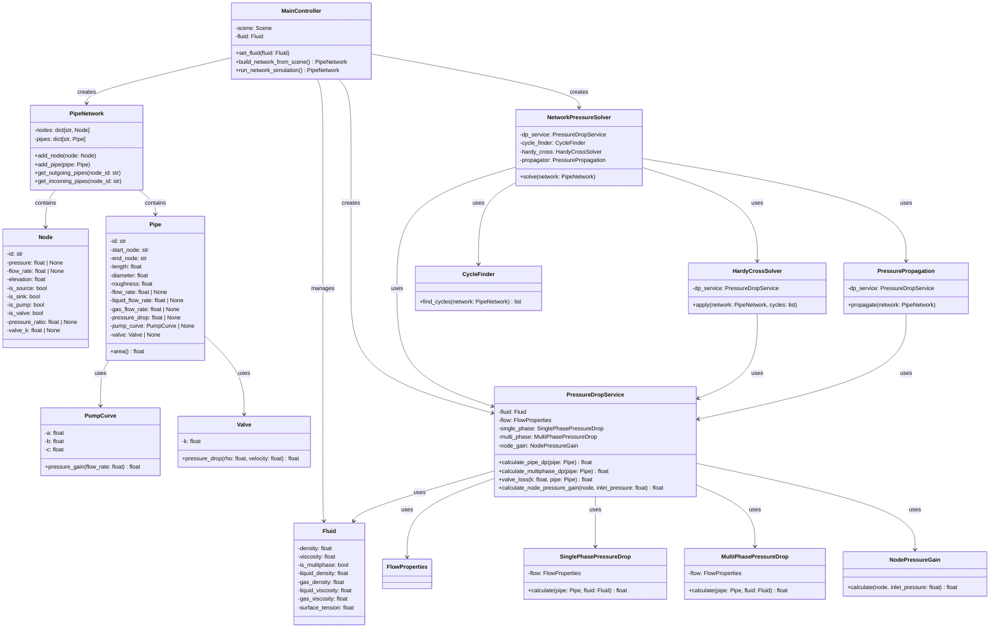

# Pipe Simulation App - UML Architecture

## Class Diagram



## Architecture Overview

### Core Layers

**Data Models Layer** (`app/models/`)
- `Node`: Represents network nodes (sources, sinks, pumps, valves)
- `Pipe`: Represents pipes with flow and equipment properties
- `PumpCurve`: Quadratic pump performance model
- `Valve`: Valve loss coefficient model
- `Fluid`: Single-phase and multi-phase fluid properties

**Network Layer** (`app/map/`)
- `PipeNetwork`: Graph structure managing nodes and pipes
- Provides connectivity queries (incoming/outgoing pipes)

**Service Layer** (`app/services/`)

1. **Pressure Drop Service**
   - `FlowProperties`: Base flow calculation properties
   - `SinglePhasePressureDrop`: Single-phase pressure drop calculation
   - `MultiPhasePressureDrop`: Multi-phase flow pressure drop
   - `NodePressureGain`: Pump and valve pressure changes
   - `PressureDropService`: Orchestrates all pressure drop calculations

2. **Solver Service**
   - `CycleFinder`: Identifies loops in network
   - `HardyCrossSolver`: Iterative solver for looped networks
   - `PressurePropagation`: Propagates pressures through tree networks
   - `NetworkPressureSolver`: Orchestrates the complete solving process

**Controller Layer** (`app/controllers/`)
- `MainController`: Bridges UI and simulation
  - Builds network from UI scene
  - Manages fluid properties
  - Orchestrates simulation execution

## Data Flow

```
User Input (UI Scene)
    ↓
MainController.build_network_from_scene()
    ↓
PipeNetwork (in-memory graph)
    ↓
MainController.run_network_simulation()
    ↓
NetworkPressureSolver.solve()
    ├→ CycleFinder.find_cycles()
    ├→ HardyCrossSolver.apply() [if cycles exist]
    └→ PressurePropagation.propagate()
    ↓
Simulation Results
    ↓
Results View (UI Display)
```

## Key Design Patterns

- **Dependency Injection**: Services receive dependencies via constructor
- **Separation of Concerns**: UI, models, services, and solving are isolated
- **Graph Processing**: Network represented as adjacency dict for efficiency
- **Component-based Architecture**: Pressure drop calculations modularized
